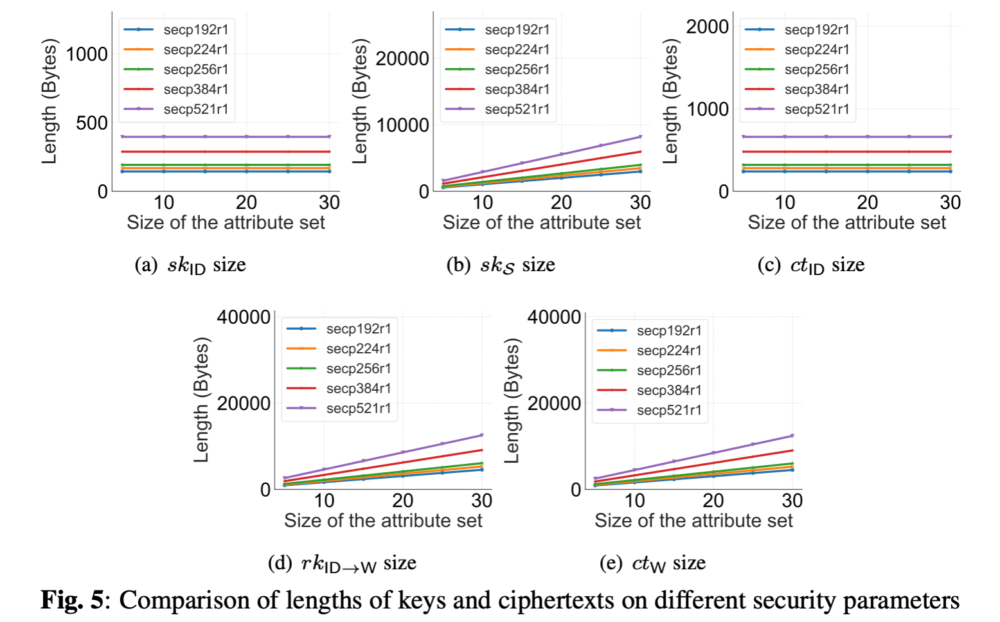

# HyPRE
Hybrid proxy re-encryption (HyPRE) for secure data storage and sharing in the cloud.

## 1. Dependencies
- C/CXX compiler: GNU 9.0+
- OpenSSL version "1.1.1f"
- [PBC Library v0.5.14](https://crypto.stanford.edu/pbc/download.html)
- cJSON

## 2. Build
```
cd hypre
mkdir build & cd build
cmake ..
make
```

## 3. Test Results
### Comparison on the running time for the related schemes.
Fig.1 shows the running time of HyPRE, IB-BPRE and AB-PRE. It can be seen that our HyPRE scheme is 2 times and 3 times faster than IB-BPRE and AB-PRE for the re-encryption algorithm, respectively. Besides, our HyPRE outperforms IB-BPRE and AB-PRE for the decryption algorithms. In the re-encryption key generation algorithm and the decryption algorithm for an attribute list, with the increase of the number of identities or attributes, the running time of IB-BPRE increases exponentially. The running time of the corresponding algorithms in our HyPRE and AB-PRE in IB-BPRE only increase linearly. 


### Comparison on the running time for the mobile device and the PC
**Fig.2 shows the running time of algorithms in our HyPRE scheme on the PC and the mobile device, and it is easy to find that for the mobile device, the running time cost of each algorithm has increased, but the scale of the increase is controllable and still linearly related to the number of attributes.**


In Fig.3, we show the comparison of key lengths and ciphertext lengths. There are two types of private keys in our HyPRE. Through the comparison, we find that the private key under an attribute set in our HyPRE is longer than other schemes, while the private key for an identity in HyPRE remains as short as IB-BPRE. Considering the private key is not frequently transmitted in the network, and the user only needs to save their own secret key, such additional cost is acceptable.


We test our HyPRE over different types of elliptic curves following the NIST standard for elliptic curve parameters. Fig.4 and Fig.5 show the comparisons of execution time of each algorithm and key/ciphertext length of HyPRE on `secp192r1`, `secp224r1`, `secp256r1`, `secp384r1` and `secp512r1` curves, where the length of the prime field varies from 192 bits to 512 bits. The results demonstrate that both of the execution time of the algorithms and the lengths of keys/ciphertexts increase linearly with the length of curve parameters growing.


